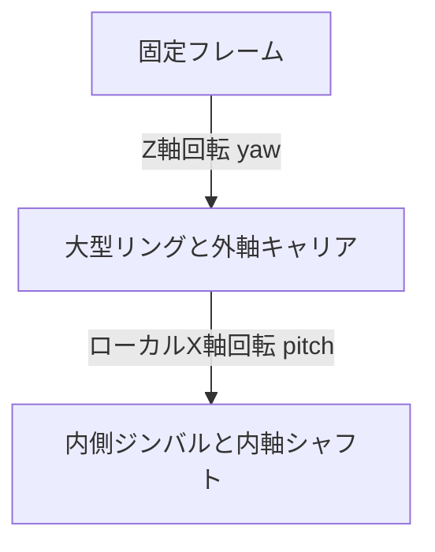

# 2軸ギヤ駆動ジンバル 試作モデル設計

## 1. 文書の目的

この文書は、実装開始前に「今回どのような機械モデルを生成するか」を固定する設計契約である。

本試作は、約300 mmの大型リングギヤを外周駆動する外軸と、リング内のシャフトをギヤ駆動する内軸を組み合わせた2軸ジンバルを、RustによるCAD-as-codeとして生成する。

形状生成、運動学、干渉検査、製造用データ、静止画およびアニメーションは同じ設計パラメータから派生させる。手作業で作成したCADファイルはsource of truthにしない。

## 2. 試作の範囲

今回作成するものは、機構配置、ギヤ比、回転方向、可動範囲、組立関係および概略干渉を検証するための概念試作である。

次の項目は今回の検証対象に含める。

- 外径約300 mmの大型リングギヤ
- 大型リングの内歯と外歯
- 180度離れた2組の外軸駆動・計測ユニット
- 各ユニットのDCモーター1個、減速機、動力分配機構
- 各ユニットの内側駆動ピニオン2個
- 各ユニットの外側エンコーダピニオン1個
- エンコーダピニオンを予圧する平行板ばね機構
- 軸方向脱落を防止する着脱式フランジ
- 内側ジンバル、内軸シャフトおよび単純な内軸減速ギヤ
- 外軸と内軸の運動学
- ギヤの回転同期を含むアニメーション
- 部品単体および組立状態の3Dモデル
- FDM部品とレーザー加工部品を混在させた製造指定

次の項目は今回の完了条件に含めない。

- 実荷重に対する強度保証
- モーター、軸受、板ばねの最終選定
- 疲労寿命、振動、騒音、摩耗、熱の評価
- 人が搭乗する用途に対する安全認証
- 最終公差および量産性の確定
- 実機制御回路およびモータードライバの実装

生成モデルが正常に動くことは、実機が安全に使用できることを意味しない。

## 3. 座標系と可動関係

基準姿勢では大型リングをXY平面に置き、その中心を原点とする。

- 外軸: 原点を通るZ軸
- 内軸: 大型リングとともに外軸回りへ回転するローカルX軸
- 外軸角: `yaw`
- 内軸角: `pitch`
- 右手系
- 長さの内部単位: mm
- 角度の内部単位: radian



外軸駆動ユニットは固定フレーム側へ取り付け、大型リングがその間を相対回転する。内軸支持部は大型リング側へ取り付け、大型リングと一緒に外軸回りへ動く。

駆動ユニットと内軸支持部は基準姿勢で近接するため、ギヤ面とジンバル支持面を軸方向に分け、ハウジング同士の干渉を避ける。

## 4. 大型リングギヤ

大型リングは、同一部品上に内歯と外歯を持つ二重歯列のリングとする。

```text
リング中心側
       ↓
   内歯        リング本体       外歯
  /\/\/\ ┃━━━━━━━━━━━━┃ /\/\/\
```

- 内歯: DCモーターで駆動される内側ピニオンと噛み合う
- 外歯: ロータリーエンコーダを回す外側ピニオンと噛み合う
- 平らな側面: フランジが案内できる連続したガイド面とする
- 歯列とガイド面は同じ回転部品に属する

初期値は次のとおりとする。これらは設定ファイルから変更でき、生成時に再検証する。

| 項目 | 初期値 | 備考 |
| --- | ---: | --- |
| 外歯module | 2.5 mm | 標準20度圧力角 |
| 外歯歯数 | 118 | 外径 `m(z+2) = 300 mm` |
| 内歯module | 2.5 mm | 外歯と共通の初期値 |
| 内歯歯数 | 100 | pitch diameter 250 mm |
| リング歯幅 | 12 mm | 試作値 |
| backlash | 0.20 mm | nominal geometryとは別に検証可能にする |
| chord tolerance | 0.05 mm | 曲線polygon化の最大偏差 |

外歯と内歯の間に残るリング本体の肉厚を自動計算し、正であることと設定した最小肉厚を満たすことを検査する。

## 5. 外軸駆動・計測ユニット

同一構成のユニットを、大型リング中心に対して0度と180度の位置へ2組配置する。

1組のユニットは、リング内側の駆動ピニオン2個と、リング外側のエンコーダピニオン1個で構成する。

```text
                    リング中心側

            駆動ピニオンA     駆動ピニオンB
                  ○               ○
                    \           /
                     大型リング
                         ○
                 エンコーダピニオン
                         │
                 ロータリーエンコーダ

                     リング外側
```

内側ピニオン2個は、ユニット中心線から円周方向へ対称に離す。初期配置角はユニット中心線に対して `-18 deg` と `+18 deg` とする。2個のピニオン外形が重ならず、内歯との中心距離が一致することを自動検査する。

### 5.1 動力経路

各ユニットはDCモーター1個を持つ。モーター出力を減速してから、同歯数の2本の分配軸へ機械的に分ける。

```text
DCモーター
    │
一次減速ギヤボックス
    │
中央分配ギヤ
    ├────────────┐
    ▼            ▼
分配ギヤA      分配ギヤB
    │ 同軸        │ 同軸
駆動ピニオンA  駆動ピニオンB
       \          /
        大型リング内歯
```

中央分配ギヤと左右分配ギヤはリングのギヤ面とは異なる軸方向レイヤーへ置く。各分配ギヤと内側駆動ピニオンは同じシャフトに固定する。

同一ユニット内の2ピニオンは機械的に同方向、同角速度で回す。位相は内歯の配置角と歯数から決定し、手調整値に依存させない。

2組のユニット間には別々のDCモーターが残る。実機では電流制限を持つ主従制御またはトルク分担制御が必要である。外側エンコーダだけでは個々のモーター電流や負荷分担を観測できない。

### 5.2 エンコーダピニオン

各ユニットの外側ピニオンは駆動には使用せず、大型リングの外歯に従動してロータリーエンコーダを回す。

- エンコーダピニオンは外歯リングと逆方向へ回る
- 歯数比から大型リング角度へ変換する
- 2個のエンコーダ測定値の平均を代表角度として利用できる
- 2個の測定差は、ねじれ、偏心、バックラッシュ、歯飛び等の診断量として利用できる

外歯リング歯数を `Z_o`、エンコーダピニオン歯数を `Z_e` とすると、理想運動学は次式である。

```text
ring_angle = -encoder_angle * Z_e / Z_o
```

## 6. 板ばね式予圧

内側駆動ピニオン2個は固定軸とし、外側エンコーダピニオンの軸受ブロックを半径方向へ可動にする。

エンコーダ軸受ブロックは、2枚の平行板ばねで支持してリング側へ予圧する。

```text
固定フレーム
   │
   ├── 調整ねじ ──→ [可動軸受ブロック]
   │                    ○ エンコーダピニオン
   ├════ 板ばね ════════┤
   └── ハードストップ ──┘
```

- 板ばね: backlashを抑えるための半径方向予圧を与える
- 調整ねじ: 初期たわみ量を調整する
- ハードストップ: 歯底へ過度に押し込む状態を防ぐ
- 長穴: 組立時の粗調整に用いる
- 可動軸受ブロック: エンコーダとピニオンを一体で保持する

試作モデルでは板ばねを形状として表現するが、ばね定数や材質は確定値としない。実働試験では樹脂一体ばねではなく、市販のばね鋼帯等を取り付ける前提とする。

## 7. 軸方向保持フランジ

平歯車の噛み合いはリングの軸方向移動を拘束しないため、着脱式フランジを設ける。

- エンコーダピニオン: 上下の主ガイドフランジ
- 内側駆動ピニオン: より大きな隙間を持つ安全フランジ
- フランジはねじ止め式円板とし、シムで隙間を調整可能にする
- フランジは通常時に強く擦らせず、軸方向ガイドおよび脱落防止として使う

初期軸方向隙間は、エンコーダ側を片側0.5 mm、駆動側を片側1.0 mmとする。FDMリングの反りを考慮し、値は設定可能にする。

フランジは歯飛びや回転方向のbacklashを解決しない。それらは中心距離、半径方向予圧、歯幅、位相同期およびハードストップで管理する。

## 8. 内側ジンバル駆動

内側ジンバルは、大型リング上の対向する支持部に通したシャフトで回転する。

- 内軸シャフトの片側に大歯車を固定する
- ギヤボックス付きDCモーターの小ピニオンで駆動する
- 反対側は軸受支持を主とする
- 内軸の歯車列は外軸の三角形ユニットとは独立する
- 内軸モーターとギヤボックスは大型リング側へ搭載し、外軸と一緒に移動する

初期試作は単純な一段平歯車減速とし、軸受、キー、止め輪およびボルトの概略包絡形状を含める。

## 9. 製法

部品ごとに製法を指定し、単なる出力形式の違いとして扱わない。

| 部品 | 初期製法 |
| --- | --- |
| 大型二重歯リング | FDM |
| 駆動・分配ギヤ | FDM |
| エンコーダピニオン、フランジ | FDM |
| ギヤボックス、軸受ブロック | FDM |
| ジンバル側板、モーターマウント板 | laser-cut plywood |
| シャフト、軸受、ねじ、板ばね、モーター、エンコーダ | purchased |

300 mmリングは初期モデルでは一体形状として生成する。プリンタの造形範囲に入らない場合の分割、継手および位置決め機構は次段階とし、勝手に切断した製造データを生成しない。

## 10. 運動と検証

運動学では、次の回転関係を検査する。

- 内歯と駆動ピニオンは同方向回転
- 外歯とエンコーダピニオンは逆方向回転
- 同一ユニットの2本の駆動ピニオンは同角速度
- 180度反対側のユニットも同じリング角度を生成
- 内軸角は外軸座標系に従属

少なくとも次を自動テストする。

- parameter rangeと単位
- 内外歯、各ピニオンのmoduleとpressure angleの互換性
- 大型リングの外径
- 内外歯間の最小肉厚
- ピニオン中心距離
- 同一ユニット内のピニオン同士の非干渉
- ギヤ位相と回転方向
- エンコーダ角からリング角への逆算
- 可動範囲全域の主要部品干渉
- 各solidのpositive volumeとmanifold status
- 3MFのmm単位と再読込
- DXFのmm単位、閉輪郭、layer
- 同一入力からのartifact hash再現性

ギヤ噛み合いの解析は剛体運動学と形状干渉までとし、接触応力、弾性変形および潤滑は対象外とする。

## 11. 視覚確認用成果物

生成物はすべてGit管理外の `output/` に出す。

```text
output/
├─ model/
│  ├─ assembly.3mf
│  ├─ assembly.stl
│  └─ parts/
├─ fabrication/
│  └─ laser/
├─ animation/
│  ├─ gimbal-motion.gltf
│  └─ gimbal-motion.bin
├─ preview/
│  ├─ isometric.png
│  ├─ top.png
│  ├─ side.png
│  ├─ drive-unit-detail.png
│  └─ motion.mp4 または motion.gif
└─ manifest.json
```

静止画は最低でも等角、上面、側面、駆動ユニット詳細の4視点を生成する。アニメーションは外軸、内軸、4本の駆動ピニオン、2本のエンコーダピニオンおよび内軸ギヤの回転関係を表示する。

レンダラーが利用できない環境でもanimated glTFまでは生成する。PNGおよび動画のレンダリング処理はcoreから分離したadapterとする。

## 12. 参照元との関係

`C:\projects\birdman\tokutori\操舵_cover` は、parameter-driven geometry、複数成果物生成、DXF検証および干渉検査の考え方を参照する。

旧プロジェクトのPythonソースや生成形状をコピーしない。本試作の約300 mmジンバルは旧カバーの内幅97.35 mmには収まらない独立ユニットである。

## 13. 設計変更規則

次の変更はこの文書を更新してから実装する。

- ユニット数またはモーター数の変更
- 内歯・外歯の役割変更
- エンコーダ位置の変更
- 板ばね以外の予圧方式への変更
- 外径または軸構成の大幅変更
- 製法の変更に伴うassembly interface変更

寸法調整、tolerance調整、描画色等の非構造的変更はparameterおよびテストの更新で扱う。
