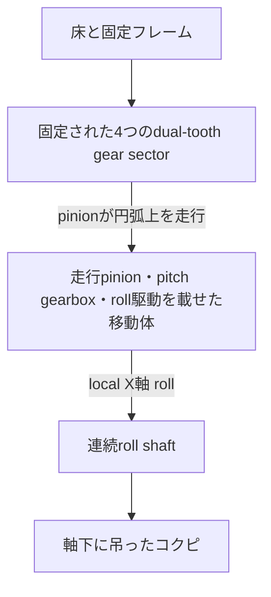

# 2軸コクピ姿勢シミュレータ 試作モデル設計

> [!WARNING]
> 本書の固定frame、sector補強、締結、軸継手およびgear meshの一部には既知の不成立箇所があり、現在再設計中である。問題記録とPhase計画は [Assembly・機械接続 再設計計画](assembly-remediation-plan.md) を参照すること。現時点の加工データと可視化出力は機械的成立性を証明しない。

## 1. 目的と安全境界

本試作は、長さ170 mmの直方体で表したコクピをpitchとrollの2軸で動かす、Rust製CAD-as-codeモデルである。yaw自由度は持たない。

同一の検証済みparameterから、形状、assembly、運動、加工データ、静止画および動画を派生生成する。Blenderや3MFはsource of truthではない。

本試作は無動力の機構配置・歯車比・可動範囲確認用であり、荷重保証を行わない。本番想定の直径約2 m、可搬質量50–80 kgへ単純拡大してはならない。人を載せる実機では、歯車とは独立した軸受と荷重経路、落下防止、保持ブレーキ、非常停止、機械式終端、過負荷検出、強度・疲労解析および有資格技術者によるreviewを必須とする。

## 2. 座標系と運動主体

- X軸: コクピ前方。連続roll shaftの軸
- Y軸: コクピ右方向。pitch回転軸
- Z軸: 上方向
- 長さ: mm
- 角度: core内部ではradian

pitch機構では大型部分歯車が動くのではない。正しい親子関係は次である。



固定物は床、上下レール、前後接続材および大型gear sectorである。pitchで動くのは接触pinion、pitch gearbox、前後roll gearbox、roll shaftおよびコクピである。

## 3. 固定pitch track

Y=±50 mmに2枚の平行な固定carrierを置く。各carrierは一周のringを持たず、X軸の前後方向に中心±30度のdual-tooth sectorを1個ずつ持つ。合計4 sectorである。

| 項目 | 初期値 |
| --- | ---: |
| reference外径 | 299.2 mm |
| carrier中心面間隔 | 100 mm |
| sector数 | 4 |
| sector半角 | 30 deg |
| 外歯reference | module 0.8 / 372 teeth |
| 内歯reference | module 0.8 / 338 teeth |
| 歯面幅 | 8 mm |
| 最小radial web | 10 mm |
| pitch可動範囲 | ±20 deg |

reference teethは仮想full circleのpitch geometryを定義する値であり、物理sectorの歯数ではない。sector中央はroll軸延長線と一致し、中央を欠損させない。外側drive pinion中心をunit中央から±7.5度に置き、pitch端角20度でもsector端まで2.5度を残す。validatorは少なくとも2度のend marginを要求する。

16 mm局所backbone、sectorへ食い込むend clampおよび別板を重ねるlower gusset案は、接続を正の体積交差で代用する誤設計だったため撤回する。

現在の再設計では、上レールと下レールを前後4本の垂直postで結び、同じnodeを左右方向の矩形crossmemberで接続する。各sectorはpinion通過域を避けて上下に分離した一体supportを持ち、post端面へ接触させる。sector→post→upper/lower rail→floorの荷重経路はtyped `SurfaceContact` relationで追跡する。sector支持部、rail、post、crossmemberは別部品の内部を重ねず、stable datum、接触面および後続Phaseで実装する締結を用いる。最終締結数と強度は [再設計計画](assembly-remediation-plan.md) のPhase 4以降を完了するまで確定扱いにしない。

下レールの下面を床上面Z=-122 mmへ直接接地させ、細い追加脚は設けない。下側の前後接続材も同じ床面へ接する。

## 4. pitch走行unit

各sector中央に1組、合計4組の移動unitを置く。1 unitは次を持つ。

- 外歯側drive pinion 2個
- 内歯側retention/future-encoder pinion 1個
- drive/encoder guide flange
- 2段compound reduction gearbox
- 2本へのdistribution gear
- input shaftと将来encoder interface shaft
- encoder bearing blockと平行leaf spring 2枚
- 軸受bossをribで結んだside plate、shaft、上側carrier connectionおよびmount

接触pinionは18 teeth、module 0.8、外径約16 mmである。外側2個のdrive pinionはunit中央から±7.5度、中心間約40.7 mmに配置する。prototype全体ではdrive pinion 8個、retention pinion 4個、接触歯車合計12個となる。

各unitの2 drive pinionと1 retention pinionは一箇所へ密集させず、利用可能なsector長の範囲で接触点間隔を広げる。これにより移動carriageの支持スパンを確保する。ただし複数meshの荷重が自動的に均等化されるとは扱わず、drive 2軸の位相整合、carriage剛性およびretention側の弾性予圧を別々に検証する。

pitch gearboxはmodule 0.6である。離した2本の18T branch gearを共通54T distribution gearへ接続し、その後18/54 teethの3:1を2段直列にする。distribution段の1:3と後段の9:1を相殺すると、固定外歯referenceと18T drive pinionの比を含む移動体上の入力軸からpitch角までの相対回転比の大きさは62:1となる。この値はprototypeの手回し確認用であり、本番減速比ではない。

固定sector上を公転する各pinionの、移動体に対する相対回転は次である。

```text
drive pinion relative angle = +(372 / 18) * pitch angle
retention pinion relative angle = -(338 / 18) * pitch angle
```

4 unitはroll軸周辺またはコクピ上側のmoving carrierでroll駆動部と一体化する。コクピ直下のcrossbarは撤去し、コクピ下側を床clearance用keep-out volumeとして空ける。moving carrierはroll軸より24 mm上にある左右2本の182 mm長手材と、前後の`RollBearingCarrierEnd`で構成する。このcarrier endは左右railの端部tie、roll bearing boss、ribおよびroll gearbox支持面を一部品へ統合する。接触carriageから各長手材へ伸びる2本のtruss webと20 mm幅のrail mounting padもFDM carriage plateの同一solidへ統合する。roll gearboxだけはコクピ前後でroll軸下側に置き、carrier endから面接触するL形bracketで支持する。

ここで「外歯側／内歯側」はsectorに対する径方向、「左右frame間の内側」はY方向の軸方向配置を指し、両者を区別する。pitch gearboxとdistribution部は径方向外側のdrive pinionを駆動するが、gearbox本体は各sectorのY方向外側でなく左右frame間へ置く。各sectorのmid-planeから軸方向内側へ、近側支持板6.5 mm、第一gear layer 10.5 mm、遠側支持板24.0 mmの順に配置し、左右の遠側支持板間には52 mmの中央通路を残す。軸方向外側には接触pinionの反対側支持板とretention preload部だけを置く。motorとrotary encoder本体は今回含めない。

各pitch/roll gearboxの露出input shaftには、No.2プラスドライバーで低荷重手回しできるPH2-compatible cross recessを設ける。これはprototypeのkinematics確認用であり、規格適合、高トルク耐久または本番入力interfaceを保証しない。

## 5. roll機構とコクピ吊下げ

roll shaftはX方向へ前から後ろまで切らずに通す。

| 項目 | 初期値 |
| --- | ---: |
| roll shaft | 長さ270 mm / 直径8 mm |
| コクピ | 170 × 45 × 45 mm |
| roll軸からコクピ中心まで | 下へ42 mm |
| roll可動範囲 | ±35 deg |

コクピは2個のhangerでshaft下へ吊るす。重心をroll軸より下に置くため、駆動が無トルクになった場合はroll=0付近へ戻す方向の重力モーメントを持つ。ただし、減速機の固着、歯欠けによる噛み込み、摩擦または配線拘束がある故障では復元しない。安全保持機能として扱ってはならない。

shaft前後に同じ36T driven gearを固定し、各端を18T output pinionで駆動する。各端にはroll軸の下側にmodule 0.6、18/54T×2段の9:1 gearbox、3本のshaft、軸受bossとribから成るside plateおよびpitch移動体へのmountを置く。roll最終段2:1を含む入力対コクピ比は18:1である。

前後2入力を同時駆動する場合は機械同期またはtorque-sharingが必要である。本試作は両端のmechanical interfaceを示すだけで、2 motor制御の成立を保証しない。

## 6. 床と設置高さ

床上面はpitch/roll交点から122 mm下に置く。固定下レール中心は軸から118 mm下であり、レール下面が床へ直接接する。

検証ではpitch/roll limitの組合せについて、吊下げコクピ、可動crossmember、roll gearbox plateおよびmount armと床とのsolid intersectionがないことを確認する。core側の包絡検査では5 mm以上の設計余裕も要求する。床位置は描画専用値ではなくvalidated parameterである。

## 7. 製法

| 種別 | 主な部品 | canonical output |
| --- | --- | --- |
| FDM | 本prototypeの全custom part。材料profileはPLAまたはABS | 部品定義別3MF |
| laser | 本prototypeでは使用しない。次prototype用にsheet modelとexport機能を維持 | 部品定義別DXF |
| purchased | shaft、bearing、bolt/nut/washer、床等の既製品 | assembly内の参照形状 |

本prototypeの初期造形profileは、無動力・手回しのfit確認を優先してPLAを暫定既定とし、ABSへ切替可能にする。材料ごとの強度、耐熱、反り、層間強度および換気条件は未検証である。次prototypeでは各component definitionをFDM、LaserCut、Purchasedへ明示分類する。DXFはnominal profileを出力し、kerfを加えない。3MFはmm unitを明記する。STLはunitless compatibility outputだけに用いる。

## 8. 必須検証

- yawが型として存在しないこと
- 4 sectorが同一definitionのinstanceであり、pitch中も固定されること
- 8 drive pinionと4 retention pinionが移動体と公転すること
- sector中央がroll軸延長線上で欠損しないこと
- sectorから固定frameまでのtyped relationと、別instance間に正の体積交差がないこと
- pinion公転半径、回転方向および歯数比
- 4 pitch unitの同期
- roll shaftが連続し、コクピ中心が軸下にあること
- 前後roll gearboxの部品数とgear ratio
- pitch/roll limit
- 固定下レールと下側接続材が床へ直接接すること
- 可動範囲全体で床およびgearbox内部にsolid interferenceがないこと
- 可動範囲全体で短縮コクピとbearing pedestal、roll gearbox mountが干渉しないこと
- positive-volume manifold mesh
- glTFのZ-up coreからY-upへの正しい変換
- DXFのmm、CUT layer、closed contour再読込
- 3MF、STL、OBJ、glTF、PNG、MP4およびmanifestの生成

## 9. 生成物

`output/` はGit管理外とする。

```text
output/
├─ model/                 # assembly 3MF/STL/OBJ と blend
├─ animation/             # animated glTF + bin
├─ fabrication/
│  ├─ fdm/                # definition別3MF
│  └─ laser/              # definition別DXF
├─ preview/               # 方向別PNG、全体/gearbox別の連番とMP4
└─ manifest.json
```

Blenderはinspection adapterであり、設計計算や運動学を再実装しない。
