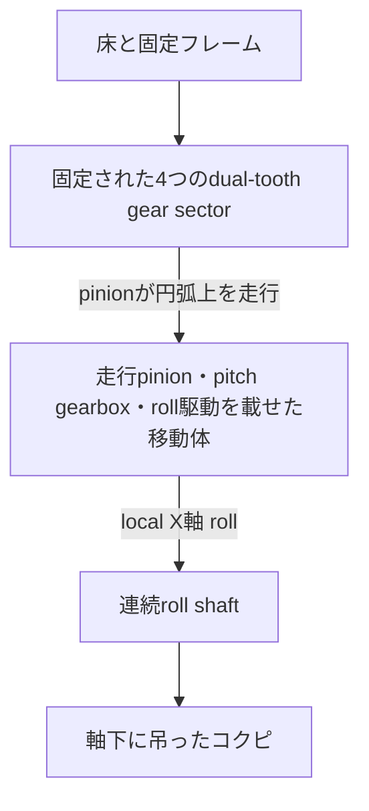

# 2軸コクピ姿勢シミュレータ 試作モデル設計

## 1. 目的と安全境界

本試作は、長さ225 mmの直方体で表したコクピをpitchとrollの2軸で動かす、Rust製CAD-as-codeモデルである。yaw自由度は持たない。

同一の検証済みparameterから、形状、assembly、運動、加工データ、静止画および動画を派生生成する。Blenderや3MFはsource of truthではない。

本試作は無動力の機構配置・歯車比・可動範囲確認用であり、荷重保証を行わない。本番想定の直径約2 m、可搬質量50–80 kgへ単純拡大してはならない。人を載せる実機では、歯車とは独立した軸受と荷重経路、落下防止、保持ブレーキ、非常停止、機械式終端、過負荷検出、強度・疲労解析および有資格技術者によるreviewを必須とする。

## 2. 座標系と運動主体

- X軸: コクピ前方。連続roll shaftの軸
- Y軸: コクピ右方向。pitch回転軸
- Z軸: 上方向
- 長さ: mm
- 角度: core内部ではradian

pitch機構では大型部分歯車が動くのではない。正しい親子関係は次である。



固定物は床、上下レール、前後接続材および大型gear sectorである。pitchで動くのは接触pinion、pitch gearbox、前後roll gearbox、roll shaftおよびコクピである。

## 3. 固定pitch track

Y=±50 mmに2枚の平行な固定carrierを置く。各carrierは一周のringを持たず、X軸の前後方向に中心±30度のdual-tooth sectorを1個ずつ持つ。合計4 sectorである。

| 項目 | 初期値 |
| --- | ---: |
| reference外径 | 299.2 mm |
| carrier中心面間隔 | 100 mm |
| sector数 | 4 |
| sector半角 | 30 deg |
| 外歯reference | module 0.8 / 372 teeth |
| 内歯reference | module 0.8 / 350 teeth |
| face width | 6 mm |
| pitch可動範囲 | ±20 deg |

reference teethは仮想full circleのpitch geometryを定義する値であり、物理sectorの歯数ではない。sector中央はroll軸延長線と一致し、中央を欠損させない。端部は歯面接触域の外に8度以上のmarginを持つ。

上下レールはZ=±118 mmへ置き、sector端とは短いlinkで接続する。これは内側可動体との間隔を確保するためである。下レールの下面を床上面Z=-122 mmへ直接接地させ、細い追加脚は設けない。下側の前後接続材も同じ床面へ接する。

## 4. pitch走行unit

各sector中央に1組、合計4組の移動unitを置く。1 unitは次を持つ。

- 内歯側drive pinion 2個
- 外歯側retention/future-encoder pinion 1個
- drive/encoder guide flange
- 2段compound reduction gearbox
- 2本へのdistribution gear
- input shaftと将来encoder interface shaft
- encoder bearing blockと平行leaf spring 2枚
- 軸受bossをribで結んだside plate、shaft、moving crossbarおよびmount

接触pinionは18 teeth、module 0.8、外径約16 mmである。prototype全体ではdrive pinion 8個、retention pinion 4個、接触歯車合計12個となる。

pitch gearboxはmodule 0.6、18/54 teethの3:1を2段直列にした9:1である。固定内歯referenceと18T pinionの比を含む、移動体上の入力軸からpitch角までの理想比は約175:1となる。

固定内歯上を公転するdrive pinionの、移動体に対する相対回転は次である。

```text
drive pinion relative angle = -(350 / 18) * pitch angle
retention pinion relative angle = +(372 / 18) * pitch angle
```

4 unitはroll駆動部とmoving crossbarで一体化する。motorとrotary encoder本体は今回含めない。

## 5. roll機構とコクピ吊下げ

roll shaftはX方向へ前から後ろまで切らずに通す。

| 項目 | 初期値 |
| --- | ---: |
| roll shaft | 長さ270 mm / 直径8 mm |
| コクピ | 225 × 45 × 45 mm |
| roll軸からコクピ中心まで | 下へ42 mm |
| roll可動範囲 | ±35 deg |

コクピは2個のhangerでshaft下へ吊るす。重心をroll軸より下に置くため、駆動が無トルクになった場合はroll=0付近へ戻す方向の重力モーメントを持つ。ただし、減速機の固着、歯欠けによる噛み込み、摩擦または配線拘束がある故障では復元しない。安全保持機能として扱ってはならない。

shaft前後に同じ36T driven gearを固定し、各端を18T output pinionで駆動する。各端にはroll軸の下側にmodule 0.6、18/54T×2段の9:1 gearbox、3本のshaft、軸受bossとribから成るside plateおよびpitch移動体へのmountを置く。roll最終段2:1を含む入力対コクピ比は18:1である。

前後2入力を同時駆動する場合は機械同期またはtorque-sharingが必要である。本試作は両端のmechanical interfaceを示すだけで、2 motor制御の成立を保証しない。

## 6. 床と設置高さ

床上面はpitch/roll交点から122 mm下に置く。固定下レール中心は軸から118 mm下であり、レール下面が床へ直接接する。

検証ではpitch/roll limitの組合せについて、吊下げコクピ、可動crossmember、roll gearbox plateおよびmount armと床とのsolid intersectionがないことを確認する。core側の包絡検査では5 mm以上の設計余裕も要求する。床位置は描画専用値ではなくvalidated parameterである。

## 7. 製法

| 種別 | 主な部品 | canonical output |
| --- | --- | --- |
| FDM | gear、sector、flange、gearbox plate、mount、コクピ | 部品定義別3MF |
| laser | carrier rail、sector link、bearing pedestal | 部品定義別DXF |
| purchased | shaft、crossmember、床、leaf spring | assembly内の参照形状 |

DXFはnominal profileを出力し、kerfを加えない。3MFはmm unitを明記する。STLはunitless compatibility outputだけに用いる。

## 8. 必須検証

- yawが型として存在しないこと
- 4 sectorが同一definitionのinstanceであり、pitch中も固定されること
- 8 drive pinionと4 retention pinionが移動体と公転すること
- sector中央がroll軸延長線上で欠損しないこと
- pinion公転半径、回転方向および歯数比
- 4 pitch unitの同期
- roll shaftが連続し、コクピ中心が軸下にあること
- 前後roll gearboxの部品数とgear ratio
- pitch/roll limit
- 固定下レールと下側接続材が床へ直接接すること
- 可動範囲全体で床およびgearbox内部にsolid interferenceがないこと
- positive-volume manifold mesh
- glTFのZ-up coreからY-upへの正しい変換
- DXFのmm、CUT layer、closed contour再読込
- 3MF、STL、OBJ、glTF、PNG、MP4およびmanifestの生成

## 9. 生成物

`output/` はGit管理外とする。

```text
output/
├─ model/                 # assembly 3MF/STL/OBJ と blend
├─ animation/             # animated glTF + bin
├─ fabrication/
│  ├─ fdm/                # definition別3MF
│  └─ laser/              # definition別DXF
├─ preview/               # 方向別PNG、全体/gearbox別の連番とMP4
└─ manifest.json
```

Blenderはinspection adapterであり、設計計算や運動学を再実装しない。
