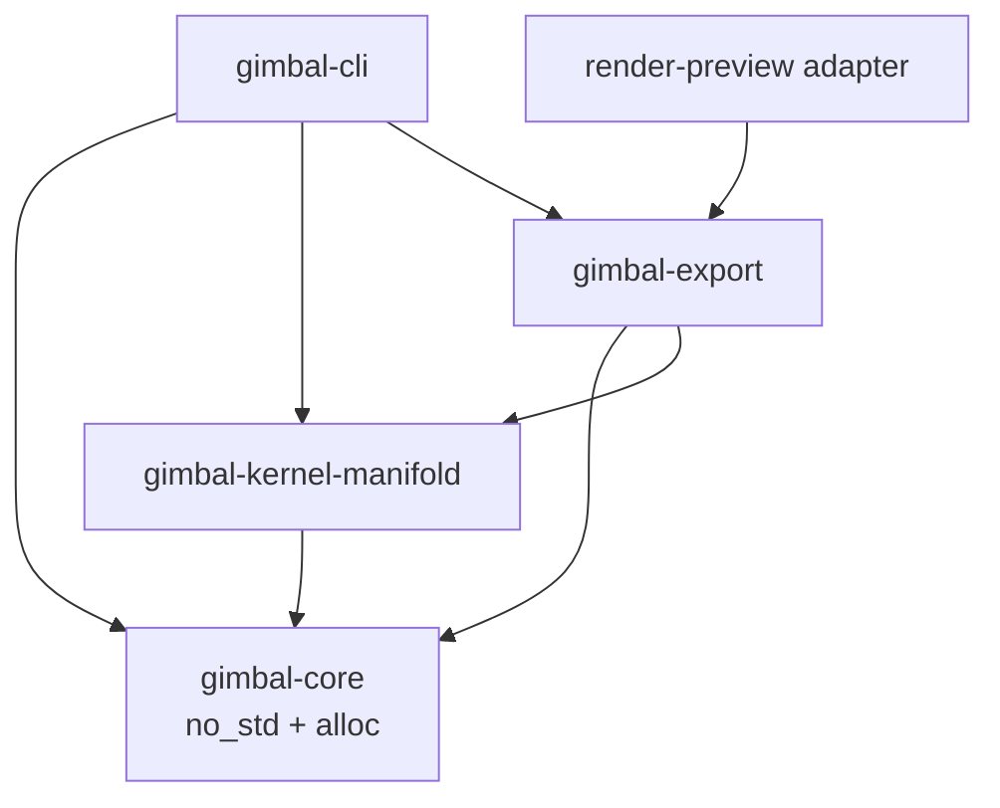

# 2軸ギヤ駆動ジンバル ソフトウェア構成

## 1. 目的

この文書は、`docs/model-design.md` の機械モデルを生成・検証するソースコードの責務と依存方向を、実装開始前に固定する。

設計の中心はCADアプリケーションのファイルではなく、検証済みparameterから2D Region、3D Solid、Assembly、ManufacturingおよびMotionを生成するRustコードである。

## 2. 基本原則

- domain coreは `no_std + alloc` を維持する
- filesystem、TOML、3MF、DXF、レンダラー、CAD kernelをcoreへ入れない
- 生の数値と文字列をCLI境界でvalidated typeへ変換する
- `Length`、`Angle`、`RegionId`、`SolidId`、`PartId`等を別型にする
- 2D Regionと3D Solidを同じhandleで扱わない
- geometry operationをimmutableなDAGとして保持する
- nominal geometryとmanufacturing compensationを分離する
- I/Oとplatform dependencyをadapterへ隔離する
- 同じ入力から同じDAGと成果物を生成する
- errorをpanicやmagic valueではなく `Result` とenumで返す
- 未実装parameterを設定ファイルへ置かない
- 生成物をsourceとしてcommitしない

## 3. Workspace構成

```text
simulator-hardware-prototype-1/
├─ Cargo.toml
├─ Cargo.lock
├─ LICENSE
├─ parameters.toml
├─ fabrication.toml
├─ docs/
│  ├─ model-design.md
│  └─ software-architecture.md
├─ crates/
│  ├─ gimbal-core/
│  ├─ gimbal-kernel-manifold/
│  ├─ gimbal-export/
│  └─ gimbal-cli/
├─ adapters/
│  └─ render-preview/
├─ tests/
│  └─ fixtures/
└─ output/                 # Git ignored
```

crate数は依存境界が異なる4個に限定する。機能単位で無制限に分割しない。

## 4. 依存関係



禁止する依存は次のとおりである。

- `gimbal-core -> gimbal-kernel-manifold`
- `gimbal-core -> gimbal-export`
- `gimbal-core -> gimbal-cli`
- `gimbal-core -> renderer`
- `gimbal-kernel-manifold -> file format writer`

## 5. `gimbal-core`

`gimbal-core` は純粋なdomain modelと計算を担当する。

```text
gimbal-core/src/
├─ lib.rs
├─ units.rs
├─ ids.rs
├─ geometry/
│  ├─ point.rs
│  ├─ curve.rs
│  ├─ region.rs
│  ├─ solid.rs
│  └─ transform.rs
├─ feature_graph.rs
├─ gear/
│  ├─ external.rs
│  ├─ internal.rs
│  ├─ pair.rs
│  └─ profile.rs
├─ gimbal/
│  ├─ parameters.rs
│  ├─ drive_unit.rs
│  ├─ assembly.rs
│  └─ kinematics.rs
├─ manufacturing.rs
└─ error.rs
```

### 5.1 単位とvalidated type

最低限、次を別型にする。

```rust
struct Length(f64);
struct Angle(f64);
struct ToothCount(u16);
struct RegionId(u32);
struct SolidId(u32);
struct PartId(u32);
```

`Length::positive_mm`、`ToothCount::new`等の検証済みconstructor以外から不正値を作れないようにする。

TOMLの値はcoreへ直接deserializeしない。CLI側の `RawParameters` を `TryFrom` で `ValidatedParameters` に変換してからcoreへ渡す。

### 5.2 2D geometry

curve semanticsを可能な限り保持する。

```rust
enum Curve2 {
    Line { start: Point2, end: Point2 },
    Arc { center: Point2, radius: Length, start: Angle, sweep: Angle },
    Circle { center: Point2, radius: Length },
    Polyline { points: Vec<Point2>, closed: bool },
}
```

involute等のparametric curveは、出力backendへ渡す時点でchord toleranceに従ってadaptive subdivisionする。固定96分割等をsource of truthにしない。

### 5.3 Feature DAG

```rust
enum SolidNode {
    Primitive(Primitive3),
    Extrude { profile: RegionId, distance: Length },
    Revolve { profile: RegionId, axis: Axis3, angle: Angle },
    Transform { solid: SolidId, transform: Transform3 },
    Boolean {
        operation: BooleanOperation,
        lhs: SolidId,
        rhs: SolidId,
    },
}
```

初期operation setは `Extrude`、`Transform`、`Union`、`Difference`、`Intersection` とする。完成したgraphはimmutableとし、builder内部だけ局所的なmutationを許す。

DAG構築時にinvalid ID、cycle、zero-length extrusionおよびdegenerate primitiveを拒否する。

### 5.4 Gear domain

外歯、内歯、外歯同士の噛み合い、内歯と外歯の噛み合いを別の型またはenumで表す。

検証対象は次のとおりである。

- module
- tooth count
- pressure angle
- backlash
- pitch/base/tip/root diameter
- standard profileのundercut条件
- center distance
- external meshとinternal meshの回転方向
- tooth phase
- adaptive subdivision error

gear理論の計算と、Manifoldへ渡すpolygon生成を分ける。

### 5.5 AssemblyとMotion

```rust
struct Part {
    id: PartId,
    solid: SolidId,
    manufacturing: Manufacturing,
    motion_group: MotionGroup,
    nominal_pose: Transform3,
}

enum MotionGroup {
    Fixed,
    YawCarrier,
    PitchCarrier,
    DrivePinion { unit: UnitId, branch: Branch },
    EncoderPinion { unit: UnitId },
    PitchPinion,
}
```

運動学は角度を入力し、各motion groupのtransformを純粋関数として返す。animation adapterも干渉検査も同じ関数を使う。

## 6. `gimbal-kernel-manifold`

`gimbal-kernel-manifold` はfeature DAGを [`manifold-rust`](https://docs.rs/manifold-rust/latest/manifold_rust/) へ評価するadapterである。

担当範囲は次のとおり。

- 2D Regionのpolygon化
- Extrude、primitive、transform、Booleanの評価
- `Manifold` statusの検査
- triangle meshへの変換
- volume、bounds、manifoldnessの取得
- solid-solid intersection volumeによる干渉検査
- DAG node単位のcache

design codeから `manifold-rust` の型を直接参照しない。backend固有errorはadapterでdomain errorへ対応付ける。

初期backendは `manifold-rust 0.13.x` を想定する。公式crate documentationではpure Rustのtriangle mesh/CSG kernelとしてextrude、revolve、union、intersection、differenceおよびMeshGL exportを提供し、Apache-2.0で公開されている。

## 7. `gimbal-export`

`gimbal-export` は評価済みassemblyから成果物を生成する。

```text
gimbal-export/src/
├─ lib.rs
├─ three_mf.rs
├─ stl.rs
├─ dxf.rs
├─ gltf_animation.rs
├─ manifest.rs
└─ report.rs
```

### 7.1 3D manufacturing

- canonical: 3MF
- compatibility: STL

3MF writerにはpure RustでMIT licenseの [`lib3mf`](https://docs.rs/lib3mf/latest/lib3mf/) をadapter内部で使用する。unitをmillimeterとして明示し、部品名とassembly itemを保持する。

STLはunitlessであるためcanonicalにしない。互換出力としてのみ生成し、manifestへmm前提を記録する。

### 7.2 Laser cutting

- canonical: DXF
- preview: SVGまたはPDFは必要になった段階で追加

DXF writerにはMIT licenseの [`dxf`](https://docs.rs/dxf/latest/dxf/) crateを使用する。mm unit、CUT layer、closed contourを出力し、同じcrateで再読込してaudit相当の構造検査を行う。

kerfはnominal profileへ適用しない。`fabrication.toml` のlaser processからmanufacturing realizationとして適用する。

### 7.3 Animation

animated glTFは、coreのkinematicsからnode transformとkeyframeを生成する。

- fixed frame
- yaw carrier
- pitch carrier
- 4本の外軸駆動ピニオン
- 2本の外軸エンコーダピニオン
- 分配ギヤ
- 内軸駆動ギヤ

の回転を含める。

glTF animationはrenderer非依存の検証成果物であり、Blender等をsource of truthにしない。

## 8. `gimbal-cli`

`gimbal-cli` はI/Oと処理順序を管理する。

```text
Raw TOML
   ↓ parse
RawParameters
   ↓ TryFrom
ValidatedParameters
   ↓ pure build
Feature DAG + Assembly + Kinematics
   ↓ kernel evaluation
Meshes + collision results
   ↓ exporters
3MF / STL / DXF / glTF / manifest / previews
```

CLI commandは初期段階で次を提供する。

```text
gimbal generate
gimbal validate
gimbal render-preview
gimbal clean-output
```

`clean-output` は明示された `output/` だけを対象とし、workspace rootや任意pathを再帰削除しない。

## 9. Preview adapter

PNGおよび動画生成は `adapters/render-preview/` に隔離する。

adapterは生成済み3MF、STLまたはglTFとmanifestだけを読み、設計計算を再実装しない。

必須出力は次の4枚とする。

- `output/preview/isometric.png`
- `output/preview/top.png`
- `output/preview/side.png`
- `output/preview/drive-unit-detail.png`

利用可能なrendererがある場合は `motion.mp4` または `motion.gif` も生成する。rendererがない場合でも、animated glTFの生成と構造検査は成功条件に含める。

renderer固有dependencyはcore、kernelおよびexport crateへ追加しない。

## 10. 設定ファイル

```text
parameters.toml
    nominal geometryと可動範囲

fabrication.toml
    material、kerf、FDM compensation、printer/laser envelope
```

parameter schemaとderive ruleはRust sourceに置く。すべてを動的なkey-valueへ押し込まない。

文書へ現在値を手書きで複製し続けない。実装後の正確な値は `output/manifest.json` から生成し、この文書の数値は初期設計値として扱う。

## 11. 検証戦略

### 11.1 Unit test

- unit newtype
- parameter validation
- involute point、diameter、tooth symmetry
- internal/external gear pair
- gear ratioとrotation direction
- feature graph cycle rejection
- kinematic transform
- encoder angle conversion

### 11.2 Property / parameter sweep

- yawとpitch可動域のsample
- chord toleranceを変えた最大形状誤差
- 歯数、moduleおよびbacklashのvalid/invalid boundary
- artifact hashの再現性

### 11.3 Kernel integration test

- extrusion volume `V = A h`
- Boolean result status
- gearとpinionの位相別intersection volume
- 可動域での非接触部品干渉
- mesh positive volume
- 3MF round-trip
- DXF round-trip
- glTF node、accessor、animation channel整合性

ギヤ歯面は接触境界となるため、浮動小数点誤差を考慮した小さいvolume toleranceを定義する。干渉を見えなくするために描画だけをずらさない。

## 12. CIと品質ゲート

最低限、次を実行する。

```text
cargo fmt --check
cargo clippy --workspace --all-targets --all-features -- -D warnings
cargo test --workspace
cargo build -p gimbal-core --no-default-features
cargo build -p gimbal-core --target wasm32-unknown-unknown
cargo deny check
```

WASM targetが環境に未導入の場合はCIで導入し、ローカル結果では未実行と明示する。

## 13. Determinismとmanifest

`output/manifest.json` には最低限、次を記録する。

- validated parameters
- manufacturing profile
- gear ratioとcenter distance
- part一覧と製法
- feature graph hash
- 各artifactのSHA-256
- tool version
- Git commit SHAまたはdirty state
- test/validation summary
- 未検証事項

timestampはartifact identityのhash入力へ含めない。

## 14. Licenseと公開方針

repository全体はMIT Licenseで公開する。

- 各Rust sourceへ `SPDX-License-Identifier: MIT` を付ける
- dependencyはMIT、Apache-2.0、BSD等の公開互換性を確認する
- copyleft dependencyの追加は事前に判断を記録する
- 他CAD projectやgear libraryのソースをコピーしない
- gear数式は公開された一般理論から独立実装する
- reference implementationとの比較はtest-time toolとして分離する
- `.git`、virtual environment、生成物、秘密情報をrelease archiveへ含めない

公開前に `cargo deny`、secret scan、large-file scanおよびstaged-content確認を行う。

## 15. 実装順序

1. `gimbal-core` のunits、gear domain、feature DAG、kinematicsを完成させる。
2. 外歯・内歯profileとgear pair testを完成させる。
3. `gimbal-kernel-manifold` でsolidを評価する。
4. 大型リングと1組の駆動ユニットを生成し、静的干渉を検査する。
5. 180度反対側のユニット、内軸およびassemblyを追加する。
6. 3MF、STL、DXF、manifestを生成する。
7. animated glTFとPNG previewを生成する。
8. 可動域sample、artifact round-trip、lintおよびlicense checkを通す。

各段階でテストを通し、次段階へ進む。暫定的な形状簡略化は許容するが、coreとI/Oを混在させる暫定設計は残さない。
