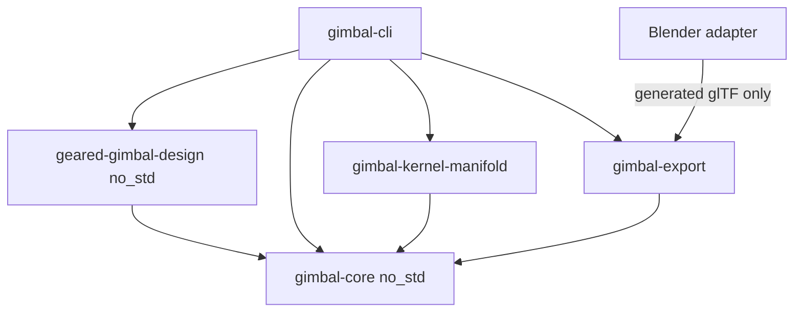

# 2軸コクピ試作 ソフトウェア構成

> [!WARNING]
> 現在のassembly・締結・嵌合・gear mesh検証は再設計中である。既知の問題とPhase計画は [Assembly・機械接続 再設計計画](assembly-remediation-plan.md) を参照すること。本書の記述だけをもって機械的成立性が検証済みとは扱わない。

## 1. 方針

設計のauthorityは、validated parameterからFeature DAG、component definition、instanceおよびframe/joint graphを作るRustコードである。

- domain coreは `no_std + alloc`
- TOML、filesystem、CAD kernel、file formatおよびBlenderをcoreへ入れない
- nominal geometryとprocess compensationを分離する
- 2D `RegionId` と3D `SolidId` を別型にする
- local geometryとassembly placementを分離する
- component definitionとinstanceを分離する
- yawを0として保持せず、自由度そのものを型から除く
- animationと検証は同じkinematicsを使う
- 生成物は `output/` に置き、Gitへ入れない

## 2. Workspaceと依存方向

```text
simulator-hardware-prototype-1/
├─ crates/
│  ├─ gimbal-core/
│  ├─ geared-gimbal-design/
│  ├─ gimbal-kernel-manifold/
│  ├─ gimbal-export/
│  └─ gimbal-cli/
├─ adapters/
│  ├─ blender/
│  └─ render-preview/
├─ parameters.toml
├─ fabrication.toml
├─ docs/
└─ output/
```



`gimbal-export` はkernelへ依存しない。両者が共有する `TriangleMesh` はcoreのbackend非依存IRである。

## 3. gimbal-core

coreは次を持つ。

- `Length`、`Angle`
- involute外歯、内歯、gear pair、`GearSector`
- 2D polygon region
- Extrude、primitive、Transform、Union、Difference、IntersectionのFeature DAG
- `Body::Solid` と `Body::Sheet`
- `ComponentDefinition` と `ComponentInstance`
- append-only `FrameGraph`
- `Joint::Fixed` と `Joint::Revolute`
- generic assembly、datum、relation、constraintおよびmesh IR

### 3.1 Local geometryとinstance

```rust
struct ComponentDefinition {
    name: String,
    body: Body,
    manufacturing: Manufacturing,
}

struct ComponentInstance {
    definition: ComponentDefinitionId,
    frame: FrameId,
    local_pose: RigidTransform,
}
```

同じsector 4個、drive pinion 8個等は一つのdefinitionを複数instanceとして配置する。kernel evaluationとFDMファイル生成はdefinitionごとに一回だけ行う。

### 3.2 FrameとKinematics

```text
World
├─ fixed floor / directly grounded rails / gear sectors
└─ PitchFrame (Y revolute)
   ├─ orbiting pitch contact units and gearboxes
   ├─ front/rear roll gearboxes
   └─ RollFrame (local X revolute)
      ├─ continuous roll shaft
      └─ suspended cockpit
```

固定sectorと公転pinionの関係はframe親子関係とgear ratioから表す。exporterに個別の角度計算を書かない。

## 4. geared-gimbal-design

既定prototype固有のparameter、cross-field validation、component definition、instance、relationおよびpitch/roll kinematicsを構築する`no_std + alloc` crateである。genericなCAD/mechanism型は`gimbal-core`から利用し、filesystem、TOML、kernelおよびexport形式へ依存しない。

## 5. gimbal-kernel-manifold

Feature DAGを `manifold-rust` へ評価するadapterである。

- region polygonのcross-section化
- primitive、extrude、transform、Boolean
- node cache
- manifold status
- triangle mesh、volume、surface area

domain codeからManifold型を参照しない。将来別kernelを追加してもcoreとexporterを変更しない境界とする。

## 6. gimbal-export

評価済みmesh、core kinematicsおよびnominal profileだけを受け取る。

| 出力 | 用途 |
| --- | --- |
| definition別3MF | FDM canonical |
| assembly 3MF | inspection |
| STL | unitless compatibility |
| OBJ/MTL | inspection fallback |
| DXF | laser nominal CUT profile |
| animated glTF | renderer非依存motion |

glTFは右手系Y-up、metreである。coreの右手系Z-up、mmから境界で次へ変換する。

```text
core (x, y, z) mm -> glTF (x, z, -y) m
```

DXFはR2013、`INSUNITS=Millimeters`、`CUT` layer、closed `LWPOLYLINE` とし、書出し直後に再読込検査する。

3MFはCore packageに必要な `[Content_Types].xml`、`_rels/.rels`、`3D/3dmodel.model` を直接生成する。ZIP timestampを固定し、同一meshからbyte-identicalな出力になることと、mm unit、object/build itemおよびXML escapingをtestする。外部3MF parserはruntime dependencyにしない。

## 7. gimbal-cli

```text
Raw TOML
  -> boundary validation
PrototypeParameters + process profiles
  -> pure build
FeatureGraph + Assembly + Kinematics
  -> kernel evaluation once per definition
  -> exporters
  -> manifest with hashes
```

commandのauthorityは`gimbal help`である。現在のcommandは次である。

```text
generate           exact static validation後にartifactを生成
generate-preview   未検証preview artifactを生成
validate           structural proxyをstatic poseで検査
validate-full      exact geometryをstatic poseで検査
refresh-manifest   既存artifactのhashを更新
clean-output       output directoryを削除
```

`validate-full`の`full`は高精細geometryを含むことを表すhistorical command名であり、全可動域を意味しない。structured reportはgeometry fidelityとmotion coverageを別fieldで出力する。`clean-output` はcanonicalizeしたworkspace直下の `output` だけを削除する。

## 8. Manufacturing境界

```rust
enum Manufacturing {
    Fdm,
    LaserCut,
    Purchased,
}
```

`Body::Sheet` は2D profile、実板厚およびassembly用extrusionを同時に保持する。laser DXFはprofileから、3D inspectionはextrusionから生成する。

kerf、FDM hole compensationおよびmachine envelopeは `fabrication.toml` のprocess profileであり、nominal Feature DAGへ混ぜない。現在のprototypeでは補正値をmanifestへ記録するが、nominal加工ファイルへ自動適用しない。

## 9. Blender adapter

Blender 5.xをbackground実行し、generated glTFをimportするだけである。

- coreと一致するX前、Y右、Z上で方向別cameraを作る
- scene boundsからcameraとlightを決める
- floorをshadow receiverとして表示する
- `.blend`、PNG、連番およびH.264 MP4を生成する
- MP4 encodingは外部FFmpegを利用可能とする

Blender固有処理はcore、kernelおよびexport crateへ入れない。

## 10. Validation

### Core/unit

- unit、gear diameter、undercut、internal/external ratio
- RegionId/SolidId分離
- append-only DAG
- nested pitch/roll frame
- pitch/roll limitとyaw非表現性
- sector中央を切らないwedge

### Repository integration

- fixed rackがpitch中も静止する
- pinion unitが一定半径で公転する
- drive/retention pinionのplanetary回転比
- 4 sector、8 drive pinion、4 retention pinion
- 前後roll gear、pinionおよびgearbox
- 軸下コクピと重力復元方向
- floor clearance parameter

### Artifact

- definitionごとのpositive volume
- 3MF mm unit
- DXF mm/CUT/closed contour round-trip
- glTF coordinate conversion、node、animation
- SHA-256 manifest

## 11. Quality gate

```text
cargo fmt --check
cargo clippy --workspace --all-targets --all-features -- -D warnings
cargo test --workspace
cargo check -p gimbal-core --no-default-features
cargo check -p gimbal-core --target wasm32-unknown-unknown --no-default-features
cargo check -p geared-gimbal-design --no-default-features
cargo check -p geared-gimbal-design --target wasm32-unknown-unknown --no-default-features
cargo audit
```

公開前にはdependency license、secrets、large files、staged contentおよびrelease archiveを検査する。

## 12. License

repository sourceはMIT Licenseとする。外部実行programのBlenderとFFmpegはrepositoryへ同梱・リンクしない。第三者gear実装をコピーせず、一般公開された数式から独立実装する。dependency追加時はMIT公開との互換性を確認する。
